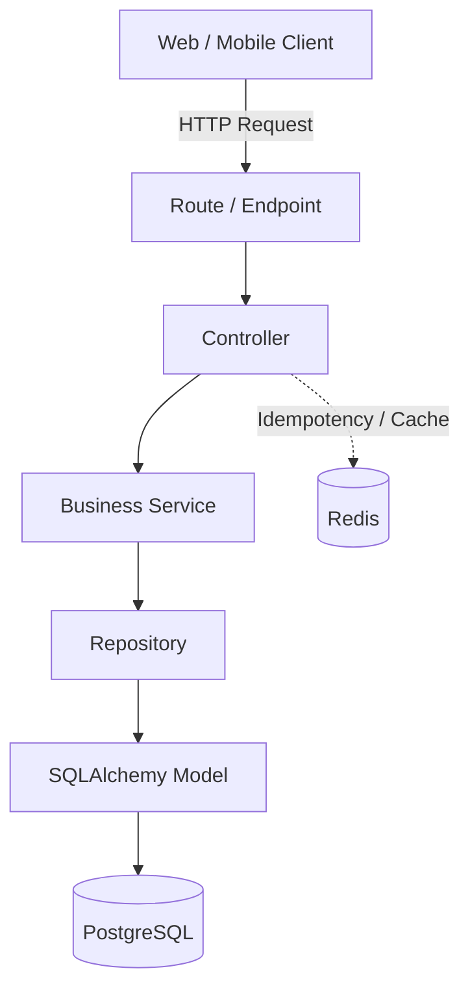

# Personal Finance API

A high-performance RESTful API for personal finance management and projection, engineered for scalability, financial data consistency, and advanced observability.

## 🚀 Architecture

The application strictly enforces a decoupling pattern across 5 distinct layers:



### Core Stack
- **Python 3.11+**
- **FastAPI**
- **SQLAlchemy (Async) + Alembic**
- **PostgreSQL**
- **Redis**
- **uv** package manager

## 🛠️ Local Development

### 1. Requirements
- Python 3.11+
- `uv` (Package Manager)
- Docker & Docker Compose

### 2. Setup
Clone the repository and spin up the infrastructure:

```bash
docker-compose up -d
```

Install dependencies and start the local environment:

```bash
uv sync
uv run uvicorn src.main:app --reload
```

## 🧪 Testing

The test suite runs against a dedicated testing database `postgres_test` ensuring complete isolation.

```bash
uv run pytest
```
