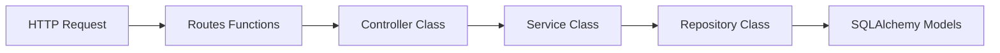
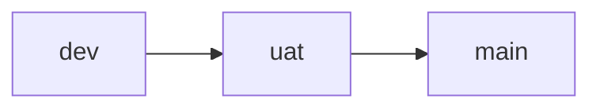

# Personal Finance & Projection API

Production-oriented asynchronous REST API for personal finance management, payment orchestration, and multi-period projections.

## Project Status

Current maturity: Planning + Governance Baseline completed.

This repository currently contains architecture and project governance foundations. Implementation starts in atomic feature slices and is promoted through `dev -> uat -> main`.

## Core Objectives

- Deliver a high-performance async API with strict financial precision.
- Enforce owner-level data isolation in every query path.
- Guarantee safe concurrent updates with optimistic locking.
- Use Redis for idempotency and projection cache acceleration.
- Provide production-grade observability, tests, and CI/CD.

## Core Stack

- Python 3.11+
- FastAPI
- SQLAlchemy 2.0 Async + Alembic
- PostgreSQL
- Redis
- uv
- structlog
- pydantic-settings
- pytest + pytest-asyncio + httpx
- Docker + Docker Compose
- GitHub Actions

## Layered Architecture

## Domain Model Scope

- Auth and security with access/refresh token flow.
- Accounts with polymorphic persistence (`accounts`, `credit_cards`).
- Expenses with STI and payment lifecycle management.
- Bill services and monthly bill issue tracking.
- Projection engine for X-month simulation.

## API Versioning

All routes are mandatory under:

- `/api/v1`

## Branching and Delivery Strategy

- `dev`: active development and feature integration.
- `uat`: acceptance and staging validation.
- `main`: stable production line.

## Commit and Review Rules

- Commit format: Conventional Commits.
- Every feature is implemented as an atomic slice.
- Every atomic slice must include:
  - complete feature code,
  - unit tests,
  - documentation updates when applicable.
- The next slice cannot start until the current one is approved and committed.

## Testing Strategy

- Unit tests are required per feature slice.
- Integration tests are concentrated in a final dedicated stage.
- Integration tests are also executable in `dev` via manual or label trigger.
- Coverage baseline:
  - minimum threshold: `80%`,
  - explicit exclusions configured through a coverage configuration file.

## High-Level Roadmap (Atomic Features)

1. Governance baseline and project standards.
2. Bootstrap with uv and Python toolchain.
3. 5-layer application skeleton and API v1 wiring.
4. Strict environment settings and fail-fast startup.
5. Structured logging and uniform error contract.
6. Async database and migration foundation.
7. Auth and security core.
8. Owner isolation enforcement.
9. Users, profiles, and categories feature.
10. Accounts and credit cards feature.
11. Expenses, payments, and optimistic locking feature.
12. Bills master-detail feature.
13. Projection engine feature.
14. Redis idempotency feature.
15. Projection cache + invalidation feature.
16. Background tasks feature.
17. Full integration test stage.
18. Containerization and CI/CD pipelines.
19. Documentation finalization.

## Progress Tracking

Task tracking with subtasks and status lives in:

- `tasks.md`

## Manual Validation Model Per Feature

Every implemented feature slice is delivered with:

1. Summary of what changed.
2. Manual validation checklist with concrete commands and expected behavior.
3. Approval gate before commit and before moving to the next slice.

## License

TBD.
